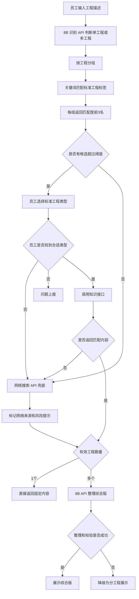

# 湖南养护工程施工交底参考系统—智能体开发文档

## 1. 文档信息

- 文档状态：第一版开发草案
- 当前阶段：智能体独立验证
- 集成目标：后续集成到现有业务系统
- 当前模型：两套独立的千问3-8B API，分别用于工程识别和多工程整理
- 知识库状态：暂不接入，使用模拟数据和抽象接口

## 2. 系统定位

系统用于识别员工描述中涉及的一个或多个养护工程，向员工展示匹配度最高的前 3 个标准工程标签。员工完成选择后，系统查询对应的养护交底内容。

- 单个工程：直接返回已有的固定养护信息，不调用 8B 整合模型。
- 多个工程：获取各工程的固定内容后，调用 8B 模型进行受控整理。
- 本地知识无匹配：调用网络搜索 API 兜底，并明确标记外部来源风险。
- 候选类型均不正确：员工可发起问题上报，系统生成缺失工程类型日志。

## 3. 第一阶段目标

### 3.1 本期实现

1. 员工输入自然语言工程描述。
2. 8B 识别 API 判断输入中包含一个还是多个工程，并返回结构化分组。
3. 使用关键词规则为每个工程匹配前 3 个标准工程标签。
4. 前端使用百分比展示“匹配度”。
5. 员工只能从候选标签中选择，不能直接新增标准标签。
6. 提供“均不匹配，网络搜索”入口。
7. 提供“问题上报”卡片和上报接口。
8. 使用模拟知识数据验证单工程直接返回流程。
9. 使用 8B API 验证多工程综合整理流程。
10. 保留本地模型、本地知识库和网络搜索的配置开关。

### 3.2 本期不实现

- 不接入正式知识库文件。
- 不开发完整的知识库管理后台。
- 不开发正式日志处理后台，仅保留数据结构和接口。
- 不集成现有业务系统的用户、权限、审批和归档能力。
- 不输出 Word 或 PDF 正式文件。
- 不训练或微调模型。
- 当前不接入本地模型服务，仅保留本地/在线调用适配能力。

## 4. 核心流程



## 5. 模块设计

### 5.1 流程编排模块

职责：

- 维护一次交互的 `request_id` 和状态。
- 调用 8B 识别模型。
- 调用关键词匹配模块。
- 等待员工选择。
- 调用知识接口或网络搜索兜底。
- 判断单工程还是多工程输出。
- 多工程时调用 8B 整合模型。
- 整理失败时降级为分工程展示。

### 5.2 8B 识别模型适配模块

当前通过第一套 API 凭据调用千问3-8B模型，仅负责工程描述分组。

职责：

- 判断输入中包含一个还是多个工程。
- 返回简单的工程分组和工程描述。
- 只输出 JSON，不输出匹配度。
- API使用 `json_object` 响应模式，完整结构写入提示词；返回结果仍由Pydantic Schema严格校验，失败时修复重试一次。

预期输出：

```json
{
  "engineering_groups": [
    {
      "group_id": "group_1",
      "engineering_description": "坑槽挖补"
    },
    {
      "group_id": "group_2",
      "engineering_description": "沥青面层铺筑"
    }
  ]
}
```

异常处理：

- API 超时时重试一次。
- JSON 不合法时进行一次格式修复重试。
- 仍然失败时向前端返回“无法识别工程组”，允许员工进行问题上报。

### 5.3 关键词匹配模块

职责：

- 维护标准工程标签、别名和关键词。
- 对 8B 识别模型返回的每个工程分组单独计算匹配度。
- 按匹配度倒序返回前 3 个标准标签。
- 返回命中关键词，便于日志分析。

第一阶段可使用 JSON 模拟标签数据，后续替换为正式知识库查询。

### 5.4 人工确认模块

职责：

- 每个工程分组展示前 3 个候选标签。
- 以百分比展示“匹配度”。
- 员工只能选择候选标签或选择“均不匹配”。
- “均不匹配”触发网络搜索兜底。
- 提供问题上报卡片。

### 5.5 知识提供者接口

当前实现 `MockKnowledgeProvider`，不读取真实知识库文件。

统一接口：

```text
get_engineering_types()
retrieve_by_type_id(type_id)
get_source_metadata(document_id)
```

后续提供知识库文件地址后，新增 `FileKnowledgeProvider` 或其他实现，不修改流程编排和前端接口。

### 5.6 网络搜索兜底模块

职责：

- 当没有超过阈值的本地候选时调用网络搜索。
- 当员工选择“均不匹配”时调用。
- 当标准标签没有对应知识内容时调用。
- 保留标题、链接、来源站点和检索时间。
- 无明确来源时不进入最终结果。
- 统一附加风险提示。

当前如果尚未提供搜索 API，先实现 `MockNetworkSearchProvider`。

### 5.7 8B 整合模型适配模块

当前通过第二套独立 API 凭据调用千问3-8B模型，仅负责多工程内容整理。

只有在有效工程数量大于 1 时调用。

输入：

- 员工已确认的工程类型。
- 每个工程对应的固定内容。
- 来源类型：本地知识或网络搜索。
- 来源元数据。

输出：

- 综合整理文本。
- 包含的工程类型。
- 来源列表。
- 网络内容风险提示。

### 5.8 整理结果校验模块

整理前提取需要保护的信息：

- 工程类型名称。
- 数字及单位。
- 标准编号。
- 来源标识。
- 必须保留的关键词。

整理后检查：

- 是否遗漏某个工程类型。
- 是否修改了受保护数值。
- 是否丢失来源。
- 网络内容是否包含风险提示。
- 输出是否为空或被截断。

校验失败时，当前阶段直接降级为分工程展示。后续切换本地 8B 模型后，可配置为自动使用 8B API 重新整理。

### 5.9 日志与问题上报模块

记录：

- 员工原始输入。
- 8B 识别模型输出。
- 前 3 个候选及匹配度。
- 员工最终选择。
- 是否触发网络搜索。
- 知识和网络来源。
- 8B 模型输出和校验结果。
- 问题上报内容。
- 模型名称、提示词版本、耗时和异常信息。

## 6. 主要接口

### 6.1 工程识别与候选匹配

```http
POST /api/v1/intent/match
```

请求：

```json
{
  "session_id": "session_001",
  "employee_input": "对路面坑槽进行挖补，并重新铺筑沥青面层"
}
```

响应：

```json
{
  "request_id": "request_001",
  "top_k": 3,
  "match_threshold": 70,
  "engineering_groups": [
    {
      "group_id": "group_1",
      "candidates": [
        {
          "type_id": "ROAD_POTHOLE_REPAIR",
          "type_name": "坑槽修补",
          "match_score": 94,
          "above_threshold": true,
          "matched_keywords": ["坑槽", "挖补"]
        }
      ],
      "network_fallback_required": false
    }
  ]
}
```

### 6.2 员工确认

```http
POST /api/v1/intent/confirm
```

请求：

```json
{
  "request_id": "request_001",
  "selections": [
    {
      "group_id": "group_1",
      "type_id": "ROAD_POTHOLE_REPAIR"
    }
  ]
}
```

### 6.3 检索养护内容

```http
POST /api/v1/knowledge/retrieve
```

请求：

```json
{
  "request_id": "request_001",
  "engineering_type_ids": ["ROAD_POTHOLE_REPAIR"],
  "allow_network_fallback": true
}
```

### 6.4 多工程综合整理

```http
POST /api/v1/output/compose
```

只有在工程数量大于 1 时调用。

### 6.5 问题上报

```http
POST /api/v1/issues/report
```

请求：

```json
{
  "request_id": "request_001",
  "issue_type": "missing_engineering_type",
  "missing_type_name": "桥梁伸缩缝特殊处治",
  "employee_description": "员工补充描述",
  "original_input": "员工原始输入"
}
```

响应：

```json
{
  "report_id": "report_001",
  "status": "pending",
  "message": "已上报：缺失“桥梁伸缩缝特殊处治”类型工程"
}
```

## 7. 数据结构

### 7.1 标准工程类型

```json
{
  "type_id": "ROAD_POTHOLE_REPAIR",
  "type_name": "坑槽修补",
  "aliases": ["坑槽维修", "坑洞修补", "路面挖补"],
  "keywords": ["坑槽", "坑洞", "挖补"],
  "enabled": true
}
```

### 7.2 知识内容

```json
{
  "document_id": "doc_001",
  "type_id": "ROAD_POTHOLE_REPAIR",
  "title": "坑槽修补施工交底",
  "content": "固定养护内容",
  "source_type": "local",
  "source_name": "知识库文件",
  "source_version": "1.0"
}
```

### 7.3 网络搜索内容

```json
{
  "type_id": null,
  "query": "桥梁伸缩缝特殊处治",
  "title": "网络资料标题",
  "content": "网络检索内容",
  "source_type": "network",
  "source_name": "来源站点",
  "source_url": "https://example.com/document",
  "retrieved_at": "2026-08-27T10:00:00+08:00",
  "warning": "当前知识库无匹配工程类型，该数据来源于网络，请注意分辨。"
}
```

## 8. 提示词设计

### 8.1 8B 识别提示词

约束：

- 只判断输入中包含几个养护工程。
- 保留员工原始表达中的工程含义。
- 不生成不存在的工程。
- 不输出标签匹配度。
- 只返回指定 JSON 结构。

### 8.2 本地知识多工程整理提示词

1. 按施工顺序组织。
2. 合并完全重复的内容。
3. 调整章节结构。
4. 改善文字衔接。
5. 保留每项工程的独有要求。

不允许：

- 自行补充技术参数。
- 修改原始数值。
- 删除看似重复但适用范围不同的要求。
- 自行解决知识资料之间的冲突。
- 引用本次输入资料之外的内容。

### 8.3 网络或混合内容整理提示词

1. 只能整理本次知识接口和网络搜索 API 实际返回的内容。
2. 不得使用模型自身知识补充。
3. 每项内容必须保留来源。
4. 网络来源与本地知识来源必须明确区分。
5. 不得把网络资料描述为企业正式交底要求。
6. 不得修改技术参数、数值、适用条件和标准编号。
7. 不同来源存在冲突时分别展示，不得自行判断。
8. 无明确来源的内容不得进入最终结果。
9. 输出开头必须提示部分或全部内容来源于网络。
10. 混合整理时不得通过改写掩盖内容来源。

## 9. 配置项

```text
# 候选匹配
TOP_K=3
MATCH_THRESHOLD=待测试确定

# 8B 识别模型 API（独立凭据）
JUDGE_MODEL_PROVIDER=api
JUDGE_MODEL_BASE_URL=https://dashscope.aliyuncs.com/compatible-mode/v1
JUDGE_MODEL_API_KEY=通过安全配置注入
JUDGE_MODEL_NAME=qwen3-8b
JUDGE_MODEL_TIMEOUT_SECONDS=30

# 8B 整合模型 API（独立凭据）
COMPOSE_MODEL_PROVIDER=api
COMPOSE_MODEL_BASE_URL=https://dashscope.aliyuncs.com/compatible-mode/v1
COMPOSE_MODEL_API_KEY=通过安全配置注入
COMPOSE_MODEL_NAME=qwen3-8b
COMPOSE_MODEL_TIMEOUT_SECONDS=120

# 知识提供者
KNOWLEDGE_PROVIDER=mock
KNOWLEDGE_FILE_PATH=待后续提供
LOCAL_KNOWLEDGE_ENABLED=false

# 网络搜索
NETWORK_SEARCH_ENABLED=false
NETWORK_SEARCH_BASE_URL=待提供
NETWORK_SEARCH_API_KEY=通过安全配置注入
NETWORK_SEARCH_FALLBACK_ENABLED=true

# 多工程整理
MULTI_PROJECT_COMPOSE_ENABLED=true
COMPOSE_FAILURE_DEGRADE_ENABLED=true

# 问题上报
ISSUE_REPORT_ENABLED=true
```

注意：`NETWORK_SEARCH_ENABLED=false` 时，即使已配置兜底规则，也不得发起网络请求。此时应转入问题上报流程。

## 10. 简易测试前端

第一阶段提供一个独立测试页面，包含：

- 员工输入框。
- 工程候选卡片。
- 前 3 个标签及匹配度。
- “均不匹配，网络搜索”按钮。
- “问题上报”按钮和输入卡片。
- 单工程内容展示区。
- 多工程综合内容展示区。
- 网络来源和风险警告区。
- 接口调试信息，仅开发环境显示。

## 11. 验收要求

### 11.1 判断和匹配

- 8B 识别 API 能返回可解析的工程分组 JSON。
- 单工程和多工程都能进入正确流程。
- 每个工程最多返回 3 个标准标签。
- 前端显示匹配度百分比。
- 低于阈值时不强制员工选择。

### 11.2 人工确认

- 员工可以分别选择每个工程的标签。
- 员工不能通过候选卡片直接新增标准标签。
- 员工可以发起“缺失××类型工程”上报。

### 11.3 单工程和多工程

- 单工程不调用 8B API。
- 多工程只向 8B API 提供已获取的固定内容。
- 8B 不得修改原始数值或遗漏某个工程。
- 8B 调用或校验失败时降级为分工程展示。

### 11.4 知识与网络来源

- 当前使用模拟知识接口，替换知识库时不修改业务接口。
- 网络内容必须有明确来源和风险提示。
- 无明确来源的网络内容不得输出。
- 网络搜索开关关闭时不得发起任何外部搜索请求。

## 12. 开发顺序

### Step 1：建立后端基础工程

- 配置管理。
- 统一错误响应。
- 请求 ID 和日志基础结构。
- 模型提供者抽象接口。

测试：启动、健康检查、配置校验和错误响应测试。

### Step 2：接入 8B 识别模型 API

- 结构化输出。
- JSON Schema 校验。
- 超时和单次重试。

测试：单工程、多工程、空输入和异常输出。

### Step 3：实现关键词匹配

- 模拟标签数据。
- 匹配度计算。
- 前 3 个候选。
- 阈值判断。

测试：精确名称、别名、多关键词、无匹配和相似类型。

### Step 4：实现候选卡片和人工确认

- 每个工程分组一张卡片。
- 单选候选类型。
- 均不匹配。
- 问题上报卡片。

测试：单组、多组、未选择、上报取消和上报确认。

### Step 5：实现模拟知识接口

- 单工程直接返回。
- 多工程返回多份内容。
- 无匹配返回统一状态。

测试：单结果、多结果、部分缺失和全部缺失。

### Step 6：接入 8B 多工程整理 API

- 本地知识提示词。
- 网络或混合来源提示词。
- 整理结果校验。
- 失败降级。

测试：两个工程、三个工程、重复内容、受保护数值和模型超时。

### Step 7：预留网络搜索和正式知识库适配

- 实现提供者接口和禁用开关。
- 在未提供实际地址时使用 Mock 实现。
- 不发起真实外部搜索请求。

测试：开关关闭、Mock 成功、Mock 无结果和提供者异常。

## 13. 待提供信息

开始真实接入前，需要补充：

1. 生产环境两套8B API的密钥和最终工作空间 Base URL。
2. 知识库文件地址和文件格式。
3. 标准工程标签、别名和关键词列表。
4. 匹配度阈值，或用于确定阈值的真实案例。
5. 网络搜索 API 服务商、接口和来源返回格式。
6. 现有系统的技术栈、鉴权和集成方式。

## 14. 后续替换正式知识库的原则

后续收到具体知识库文件地址后：

1. 先检查文件类型、编码、数据结构和版本信息。
2. 建立文件数据到统一 `KnowledgeItem` 结构的转换层。
3. 实现 `FileKnowledgeProvider`，不修改前端和流程编排接口。
4. 先使用少量真实工程进行匹配度和内容完整性验证。
5. 验证通过后，再关闭 Mock 提供者并启用正式知识库。
